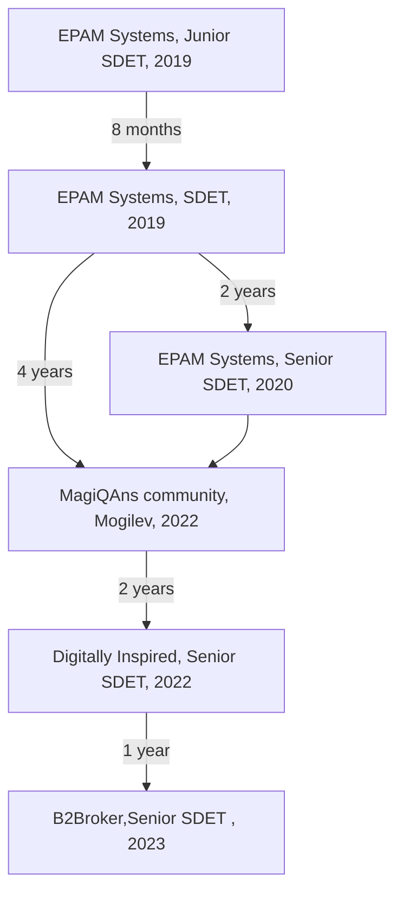
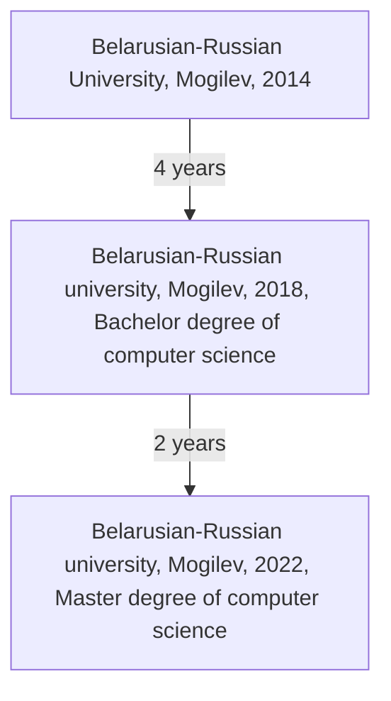

# Hi there 👋

## I am Vitali Haradkou

I'm SDET, Passions about Frontend.

Certified [Node.js Application Developer (JSNAD)](https://www.credly.com/badges/b0b8301c-faf3-4048-9b2f-e459db219878/linked_in_profile)

I love ❤️ TypeScript. Master degree of Typescript and recursive types.

Check out my recent [blog posts](https://blog-vitaliharadkou.vercel.app/blog/):

- [k6: How to test you signalR websockets](https://blog-vitaliharadkou.vercel.app/blog/09-k6-websocket)
- [@rslike/dbg: Debug your variables like never before!](https://blog-vitaliharadkou.vercel.app/blog/08-rslike-dbg)
- [@rslike/cmp: compare your structures like a pro](https://blog-vitaliharadkou.vercel.app/blog/07-rslike-cmp)
- [It's done! Rust-like API in your JavaScript code](https://blog-vitaliharadkou.vercel.app/blog/06-rslike)

My personal projects:

## Tech Stack

`JavaScript`, `TypeScript`, `Node.js`, `Selenium`, `Webdriver`, `WebdriverIO`, `Playwright`, `Puppeteer`, `TestCafe`, `Docker`, `Containers`, `AWS`, `Azure DevOps`, `Git`

## Experience

My career path:

## Education

