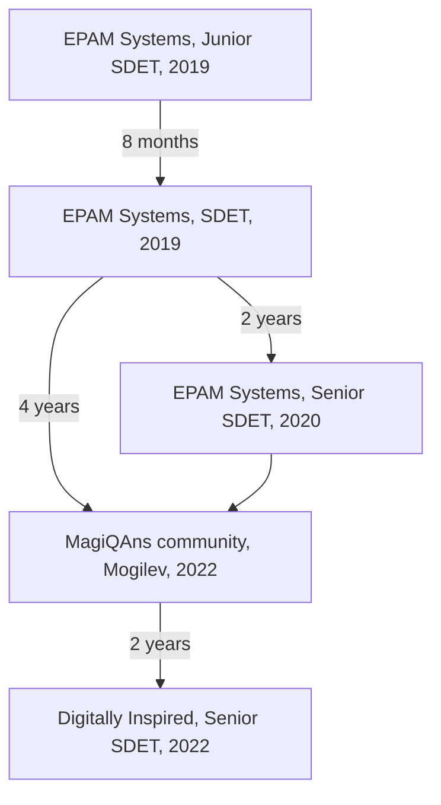
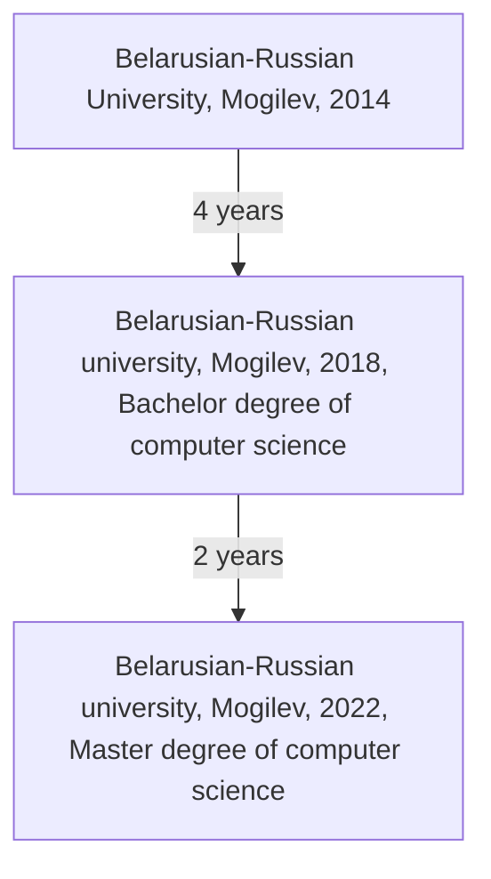

# Hi there 👋

## I am Vitali Haradkou

I'm Senior Software Engineer in Test.

Certified [Node.js Application Developer (JSNAD)](https://www.credly.com/badges/b0b8301c-faf3-4048-9b2f-e459db219878/linked_in_profile)

I love ❤️ TypeScript. Master degree of Typescript and recursive types.

Check out my recent blog posts:

- [Using dotenv-guards library for environment variables management](https://vitalicset.notion.site/Using-dotenv-guards-library-for-environment-variables-management-9f374d61c41748238bf0c5874871a42a)
- [Using JSX in telegram texts](https://vitalicset.notion.site/Using-JSX-for-telegram-bots-ef21523f91ba4eba99e3b92e639c620a)
- [get started open source fully automated repository](https://vitalicset.notion.site/Creating-fully-automated-github-repository-with-github-actions-88c9eead38cd498a887dc58bade8779f)
- [my experience of using zx](https://vitalicset.notion.site/My-experience-of-using-zx-library-036f5dd387854410ac5ed57a9aa746d6)

My personal projects:

## Tech Stack

`JavaScript`, `TypeScript`, `Node.js`, `Selenium`, `Webdriver`, `WebdriverIO`, `Playwright`, `Puppeteer`, `TestCafe`, `Docker`, `Containers`, `AWS`, `Azure DevOps`, `Git`

## Experience

My career path:

## Education

