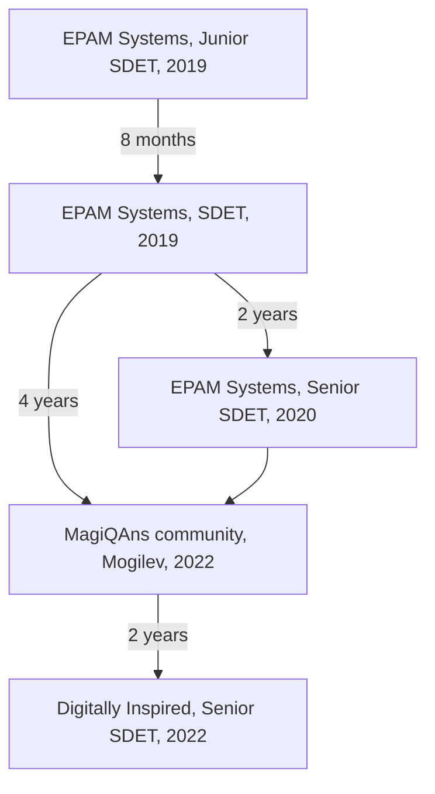
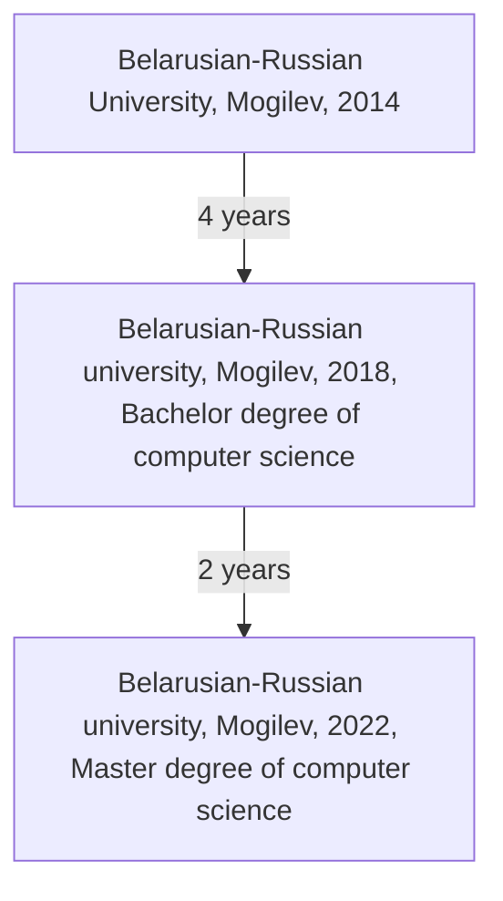

# Hi there 👋

## I am Vitali Haradkou

I'm senior test automation engineer. Founder of @magiqans.

I love ❤️ TypeScript. Master degree of Typescript and recursive types.

Check out my recent [blog](blog/README.md) posts:

- [Using dotenv-guards library for environment variables management](blog/04-dotenv-guards.md)
- [Using JSX in telegram texts](blog/03-jsx-telegram.md)
- [get started open source fully automated repository](blog/02-github-automation.md)
- [my experience of using zx](blog/01-zx.md)

My personal projects:

## Tech Stack

`JavaScript`, `TypeScript`, `Node.js`, `Selenium`, `Webdriver`, `WebdriverIO`, `Playwright`, `Puppeteer`, `TestCafe`, `Docker`, `Containers`, `AWS`, `Azure DevOps`, `Git`

## Experience

My career path:

## Education

