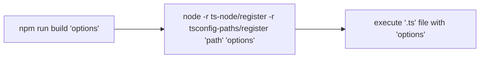

# My experience of using zx

- [Project context](#context)
- [Project structure](#project-structure)
- [Environment](#environment)
- [Problem](#the-problem)
- [Solution](#solution)
- [Performance](#performance)

## Context

My projects are very huge and complex, we're working on automotive industry and our mission - make users happy with minimal involving. The user should fullfil financial info and upload driver license - and then he can purchase any car, matched by his financial capabilities. As I mentioned before - this is huge project with a lot of involving teams. On this project my role - lead and drive core changes of automation framework.

After the reading this [article](https://www.sitepoint.com/google-zx-write-node-shell-scripts/) about zx, i'm shocked about capabilities of this library, because as you know, the node.js is not the best solution to write DevOps-like scripts, like build with extra CLI options, working with console styles, etc. If you're creating such solution - you need an extra libraries, like [fs-extra](https://www.npmjs.com/package/fs-extra) - fs with better api, [chalk](https://www.npmjs.com/package/chalk) - console styling, [yargs](https://www.npmjs.com/package/yargs) - cli options parser, and so on.

## Project structure

```txt
`.github
  `CODEOWNERS - strict `package.json` file and `scripts` folder
`package.json
`scripts
  `some.sh - sh script for aws pipeline
`src
  `cli
    `index.ts
    `commands
       `build.ts - this exactly what we need
       `lint.ts
...

```

## Environment

### Local

MacBook Pro 13-inch, 2020, Intel Core i5

- node.js LTS (16)
- npm 7

### CI (AWS Codebuild)

- node.js 14
- npm 6

## The Problem

Each command, like `build`, `lint`, `test`, has been written in typescript and runs with following options:



Now lets see build command sources

```typescript
// src/cli/build.ts
// imports with relative paths
export default class BuildCommand extends notifiable(messagable(CommandWithSpinner)) {
skip = false;
async execute() {
  // 1) run rimraf (cleanup _dist folder + remove extra folders, like reports)
  // 2) ttsc - compile typescript sources via ttypescript library
  // 3) copy (copy system files for future tests run)
  // 4) send OS notification of --notify args has been sended to CLI script
}
}
```

As we see - each command extends at least 2 mixins(notifiable, messagable) with spinner class.

This approach cannot compile himself, since CLI is under `src` folder and ttsc compile whole project under `src`

## Solution

The nodejs starts from 14 version - has possibility to run `.mjs` files.

First of all, I sync my [local](#local) `node.js` with [CI environment](#ci-aws-codebuild).

Secondly, Install zx script `npm i zx`.

Thirdly, I create `scripts/build.mjs` with following context:

```javascript
// scripts/build.mjs
import { $, fs, path, argv } from 'zx';
import copyfiles from 'copyfiles';
// notification module, since each script can be "notifiable"
import notification, { Images, Icons } from './notification.mjs';

/**
 * send OS notification
 * @example
 * ``` bash
 * npm run xz scripts/build.mjs -- --notify
 * ```
 * @default
 * false
 */
const notify = argv.notify || argv.n || false;
// OS notification settings
const settings = {
  title: 'Build',
  contentImage: Images.typescript,
};


let message = '';

try {
  // 1. rimraf
  await rimraf();

  // 2. build
  await $`node node_modules/ttypescript/bin/tsc`;

  // 3. copy files
  await copy();

  message = Icons.success + ' Build: completed successfully';
} catch (error) {
  message = Icons.error = ' Build: failed with error: ' + error.message;
} finally {
  // write output
  console.log(message);
  if (notify) {
    // write OS notification
    notification({ ...settings, message, });
  }
}

async function rimraf() {
  const reports = path.resolve('reports');
  if (fs.existsSync(reports)) {
    console.log('rimraf ', reports);
    await fs.rm(reports, { recursive: true, force: true });
  }
}
// copy files
function copy() {
  const destinationDirPath = '_dist/visual-regression';
  const inputGrep = 'src/visual-regression/screenshots/**/*.png';
  return new Promise((resolve, reject) => {
    copyfiles([inputGrep, destinationDirPath], { up: 2 }, error => {
      if (error) {
        reject(error);
      } else {
        resolve();
      }
    });
  });
}
```

Benefits: This is plain `js` file, no need to compile and use transpilers

Cons: This is not a typescript, internal modules from `src` folder unavailable, since script folder not compiles.

## Performance

Before:

Execution time takes **1 minute** for my [machine](#local).

After:

**20 seconds** with clean build.

**10 seconds** with next build runs, since in our `tsconfig.json` we enable typescript caching. ([incremental build](https://www.typescriptlang.org/docs/handbook/release-notes/typescript-3-4.html) is enabled by default)

> **Note:** Cache is not relevant option for CI, since for each build CI starts new git checkout and starts fresh build.

| Solution   |      Build(no cache)      |  Build(cache) |
|------------|:-------------------------:|--------------:|
| previous(Local) |  1 minute | 30-40 seconds |
| zx(Local) |    20 seconds   |   10-15 seconds |
| previous(CI) |  1.5 minute | N/A |
| zx(CI) |    30 seconds   |   N/A |

> *Table 1.* Total execution time by different approach.

## Conclusion

I'm happy to use [`zx`](https://www.npmjs.com/package/zx) library, It's maintained by Google, and I'm glad to use all spectre of his capabilities. Migration to zx increased speed of building about 2 times.

## Have a good day, Bye 👋
