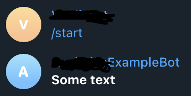

# Using JSX for telegram bots

## Table of contents

- [Idea](#idea).
- [POC](#poc).
  - [HTML](#html).
  - [Markdown](#markdown).
  - [Default](#default-format)
- [Result](#result).
- [conclusion](#conclusion).

## Idea

While I do my automation routine i was thinking about next thing: "why nobody use JSX for building messages, in most cases it's just simple HTML or Markdown?".

Yes, in mostly cases each chat application have possibility to send message as raw html. Also, I'm creator and maintainer [`Telegraph`](https://github.com/vitalics/Telegraph) repository.

This repo was created to simplify working with Telegram by simple wrapper.
While I write [`fmt`](https://github.com/vitalics/Telegraph/tree/main/packages/fmt) package i was thinking about next thing: "wait a minute, context can be replying with html by `replyWithHTML` function. And also I'm familiar with React and JSX syntax, why nobody joining this ideas?"

## POC

I start to think how to join JSX and formatting. For `html` it was simple: wrap each function to custom component which reuse built-in HTML tags.

Q: Why wrap?

A: Since each html tag may contains `class`, `style`, etc attributes, but in telegram it's not applies, so attributes should be ignored.

### HTML

Each component is very simple and primitive:

``` tsx
// filename=html/bold.tsx
import {h, JSX} from 'preact';

type Props = {
  children: string | JSX.Element
};

export default function({children}: Props){
  return <b>{children}</b>
}

```

As for render to HTML I found [`preact-render-to-string`](https://github.com/preactjs/preact-render-to-string) package from official preact team to create raw HTML nodes.

``` tsx
// filename=html/render.tsx

import {h, JSX, VNode} from 'preact';
import toString from 'preact-render-to-string';

export default function render(node:JSX.Element | VNode){
  return toString(node);
}
```

### Markdown

As for markdown I found the issue about using tags.

But I also remember about special characters, e.g. for bold text I just can write `*bold*` and the text will be bolded.

But if i return just text, it will not the match to `JSX.Element` type.

The answer is comes to me unexpectedly - `Fragment` component - this just returns children element.

Using this knowledge I start to implement components. E.g. look at the bold component in markdown implentation:

``` tsx
// filename=markdown/bold.tsx
import {h, JSX, Fragment} from 'preact';

type Props = {
  children: string | JSX.Element
};

export default function({children}: Props){
  return <Fragment>*{children}*</Fragment> // returns just `*{children}*`
}
```

As for render function I use node-html-parser, since i should get text content of received raw html-like text:

``` tsx
// filename=markdown/render.tsx

export default function render(node: VNode| JSX.Element){
  return toString(node); // markdown-like text
}
```

### Default format

What should i do when user would like to use `reply` function. This function applies raw text as a first parameter and text modifications as the second parameter.

Since `fmt` string function is working with stringified text - so i made function which reuse default `fmt` function for raw text, but i found inconsistency, and made decision do not break fmt functionality, some components are the same as for `html` realization, but some of the components has a differences with `html` realization

Similar with HTML:

``` tsx
// filename=default/bold.tsx
// imports
// props
export default function ({ children }: Props) {
  return <b>{children}</b>
};
```

Differences:

``` tsx
// filename=default/code.tsx
export default function (props: Props) {
  return <code>{props.language}||{props.children}</code>
};
```

And Render function reuse default fmt function

``` ts
export default function render(node: VNode | JSX.Element) {
  let text = toString(node); // html-like string
  return fmt(text); // returns [raw text, {modifications}]
}
```

That's why If user would like to use default components - he needs to use `rest/spread` operator.

## Result

Code

```tsx
// filename=example.ts
import { Fragment, h } from 'preact';
import { Telegraf } from 'telegraf';

import { Bold, render } from '@tlgr/fmt/default';

const TOKEN = '<API TOKEN>';
const bot = new Telegraf(TOKEN);

bot.start(ctx => {
  ctx.reply(...render(
    <Fragment>
      <Bold>Some text</Bold>
    </Fragment>
  ))
});

bot.launch();

```



### Pros

- Using JSX for describing messages in telegram context.
- Written in typescript, autocomplete is works fine.

### Cons

- many realizations, default, html, markdown. Ideally using only one render function per realization, and only one component realization.
- Pick preact instead of React. I have no idea why i choose preact. I think React is more preferable for node.js/frontend developers, but not sure about this sentence 😁

## Conclusion

As for me, I do many non-trivial works, never working with preact before, but it was a great experience.

How to use this examples:

- install [fmt](https://www.npmjs.com/package/@tlgr/fmt) package.
- install [preact](https://www.npmjs.com/package/preact) package.

**Important**: use version 1.4.0 or higher since JSX was introduced in this release, You can also read [release](https://github.com/vitalics/Telegraph/releases/tag/v1.4.0) from official [Telegraph](https://github.com/vitalics/Telegraph) repository.

> P.S. Or You can read official package API and [tutorial](https://vitalics.github.io/Telegraph/docs/tutorial/fmt/jsx) from docs page.
> P.P.S. This 1.4.0 release are also posted in Telegraph blog post [page](https://vitalics.github.io/Telegraph/blog/release%201.4.0)

## Have a good day, Bye 👋

|[Previous](02-github-automation.md)  | [Main](README.md)  | [Next](04-dotenv-guards.md)  |
|---------|---------|---------|
